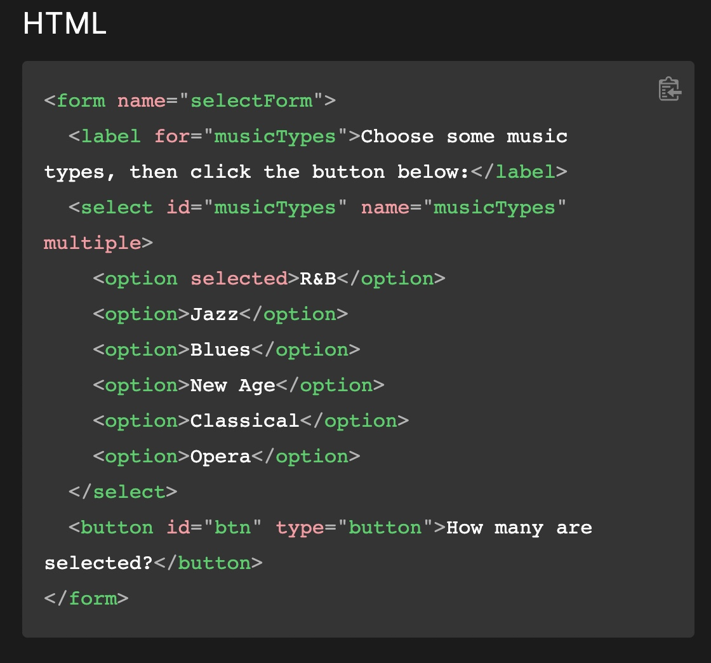
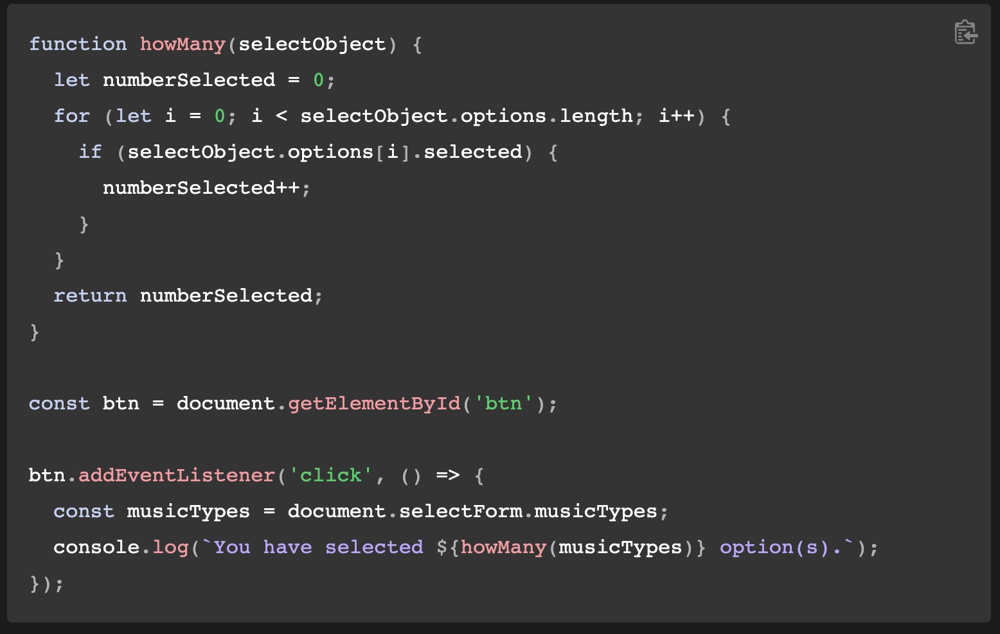
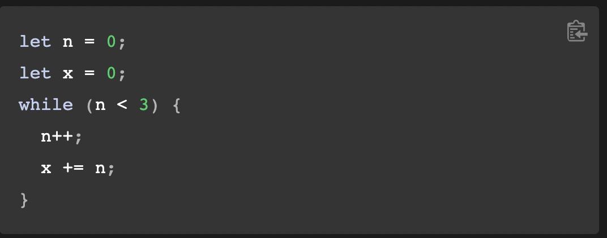
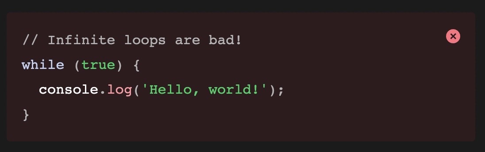
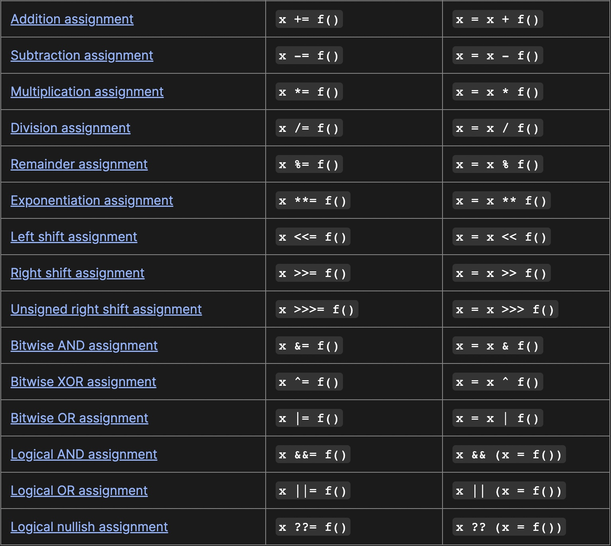
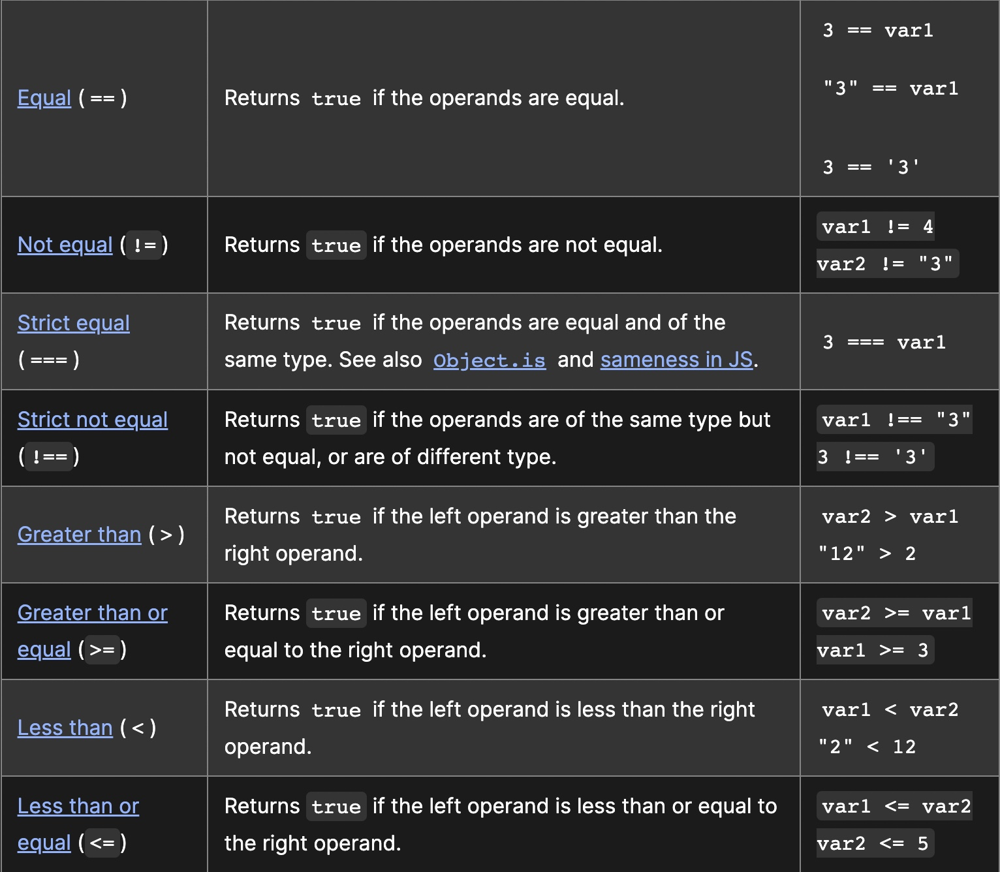

# Class 8

[Back to home page](../README.md)

Today we learned about **Operators** and **Loops**!

## For and While statements

A **For** statement is a command that will keep doing the specified command until a condition results to false.

for ([initialExpression]; [conditionExpression];

[incrementExpression])
  
  statement

The following occures during a for loop:

- The initialExpression will execute and establish any values or any other variables.
- The conditionExpression will evaluate the loop to see if it is true. if not the loop is terminated causing an error.
- The statements will then be executed, you can use multiple statements by using block statement ({}) to group them
- The initialExpression (if there is one) will be executed.
- The cycle returns to step 2 with the conditionExpression evaluating if the statement is still true.

Examples for html and javascript:

A **While** statement will execute the statement as long as the condition results to are true.

while (condition)
  
  statement

The condition will be checked before the statement. If the statement results to true the statement is executed and checked again. If the condition results to false, control is passed over to the statement following the loop. You can again use multiple statements using the block statement ({}) command.

In this example, the loop increments n and adds that value to x.

What **NOT** to do:

In this example, the user made the loop infinite, meaning there is not way for the statement to become false.

### Assignment and Comparison operators

An assignment operator will assign a value to its left operand based on the value of the right operand. A good example is x = f(). in this expression f() assigns a value to x. Here is a full list of all the assignment expressions:

[link to website](https://developer.mozilla.org/en-US/docs/Web/JavaScript/Guide/Expressions_and_Operators#assignment_operators)

A comparison operator compares its two operand and give a logical value if the comparison is true. These statements use == and !== operators to perform equality or inequality comparions. Here is a table of all the comparison expressions:

[Link to website](https://developer.mozilla.org/en-US/docs/Web/JavaScript/Guide/Expressions_and_Operators#comparison_operators)