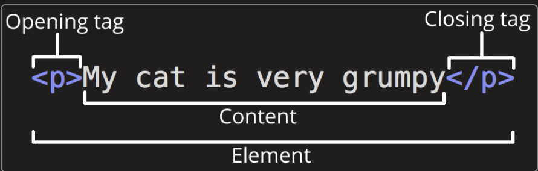
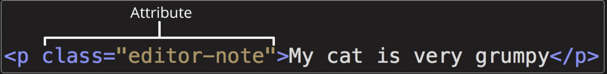

# 201 Class 1

[Back to home page](../README.md)

## The web, what is it?

The web stores all kinds of websites, code, and information. And interacting with the web to us is as simple as clicking a button, but theres alot more to it.

- Client side: or the side that we are on. The user will put in a command/request through the client side which will be sent to the...

- Server side: The other side of the web that will take the request from the user and send back a piece of content to the client side.

- There is of course much more that goes into these interactions though.

Every website is different, developers will usually start out with a rough sketch of what they want the page to look like, and adding details like size, font, color, images, anything that would stand out in your page. Things like fonts and images can be found easily on other websites that can be downloaded. But if you want to stay away from copyright claims on your page, its best to search for these things using the **Creative Commons** search option in your browser. Most websites contain the following 3 languages: HTML, CSS and JavaScript. These 3 languages are the foundation, styling, and interactible features.

- Html is the structure of your page. Any images, paragraphs, and links will be made in the Html file.

-CSS is the styling sheet for your webpage. Any color changes, boarders, and size changes will be made in this file.

- JavaScript is the programming that is done on your page. Anything interactible will be on this file.

## JavaScript

JavaScript is the language that provides all the interactivity to your webpage. Things such as a search bar, a actions if a button is pressed, or even a game on your page. Google for instance has both a search bar and
interactible buttons. You also need to log into your google account with a password which is using javascript to by pass a command.

Though javaScript is a powerful tool, to connect it to a website, similar to CSS, you will have to write the command < script src="scripts/main.js">< /script > in the head or body of the html document. However, you can use a technique called inline javascript where you write your code in script tags directly on the html document in the spaces you want. Either method works.

Variables are a very important part in JavaScript, these contain store values. You start by making a variable by using the *let* command. Ending the name with a semi cologne (;) you then assign the variable a value like 12 or even a name like "Guy". At any time in the code, you can "call" or activate the command by calling its name.

Note that JavaScript variables can have different data types. Heres a list of some example data types-

## HTML

Html as said before is the structure of a website. All images, hyperlinks, and information goes into this file of the page. This can be as complex or simple depending on the page. Html lines consist of **Elements**, which have an opening tag, closing tag, and content within the element.  Most HTML documents will include links, images, and especially text.

Some elements can be **nested** within elements. This can be as simple as using the strong tag to emphesis a certain work within a paragragh.

semantics refer to the meaning of a piece of code and what it does. For example the h1 tag in html will classify a heading as the biggest heading on the page. However you could also use a span element to make it look like an h1 heading, tho it wont have any semantic value, or making it not as important as an h1 heading in the data of a website. Thats why it is very important to use the right tag for the right situation.

Attributes are another important part of html lines. These attributes are extra i=nformation you can integrate within an element. Examples of attributes are tags like href, class, and title. 

Html docs consist of the Head and Body enclosed by an html tag.

- The head of an Html document includes the title, and links to other documents like css, and any metadata for the website. Metadata is stuff like the character set, page description, author, and keywords. This can optimize search engine data by using any keywords the user types and tracing them back to the metadata of the website the user wants.

- The body of an html document are all the content present on the page. Paragraphs, links, images, everything the user needs to see presented in information goes here.

## Things i want to learn more about--

I want to know more about JS variables and go more in depth into the language itself. More practice and review of these concepts especially writing and executing JS commands.