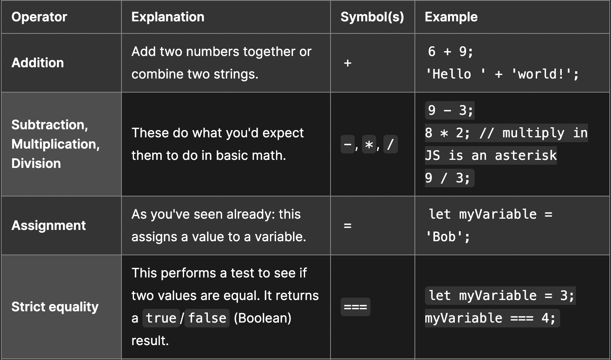

# Class 2

[Back to home page](../README.md)

## Continuing intro to html

Why is it important to use semantic elements in our HTML?

- Semantics make your code easier to understand and comprehend. It will help to structure your code overall.

How many levels of headings are there in HTML?

- There are a total of 6 headingings, from h1-h6.

What are some uses for the sup and sub elements?

- They are used to write out things such as chemical formulas or dates. Any numbers that would need to smaller towards the top or bottom.

When using the abbr element, what attribute must be added to provide the full expansion of the term?

- You need to provide an expansion of the term in the code. if the term is small enough you can include the "title" value in your code.

## Learn css

What are ways we can apply CSS to our HTML?

- We can apply Css written into our code in specific parts of our html file (inline css), written in the head of our html file with a style tag (internal css) or in a seperate file titled style.css (external css)

Why should we avoid using inline styles?

- Its not professional and can sometimes overlap styles onto other parts of your code, and makes your code look messy overall. Its not an effective use of styling.

Review the block of code below and answer the following questions:

1. What is representing the selector?

- h2

2. Which components are the CSS declarations?

- The components are black and 5px

3. Which components are considered properties?

- the properties are color and padding

## Learn js

What data type is a sequence of text enclosed in single quote marks?

- a string

List 4 types of JavaScript operators.

- 

Describe a real world Problem you could solve with a Function.

- solving a math equation is a good example. Calculators act as a whole set of functions for adding, subtracting, multiplication and division.

## Making decisions in your code

An if statement checks a condition and if it evaluates to true, then the code block will execute.

What is the use of an else if statement?

- Else if is an extra block added to a if else statement to include more options. Primarily is used if you expect more than 2 outcomes.

List 3 different types of comparison operators.

- === and !== 
- < and > 
- <= and >=

What is the difference between the logical operator && and ||?

- && will let you chain 2 expressions and allow them to individually evaluate to true, while || will let you chain 2 expressions and allow 1 or more of them to evaluate to true.