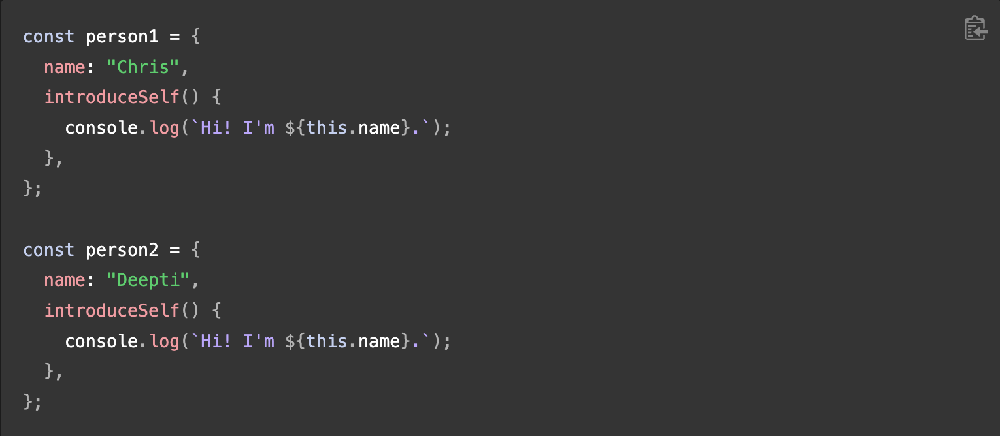

# Class 6

[Back to home page](../README.md)

## JavaScript object basics

Q. How would you describe an object to a non-technical friend you grew up with?

- An object in javascript is a collection of data, where every piece of data has a value tied to it. For example, if we have an object titled person and a piece of data inside the object called name, the **name** is the piece of data being stored, while **Sean** is the value being stored inside the data. A period or dot (.) acts as spacing, so the way you would write this out is person.name, and the return would be Sean. These can be chained multiple times like person.name.lastName;. Brackets can also be used and would look like person["name"];.

Q. What are some advantages to creating object literals?

- It means youve literally written out the object contents, and some advantages of making these are its much easier to send data this way. It makes it much faster to send an object to a database then multiple pieces of data.

Q. How do objects differ from arrays?

- They are very similar, but instead of using an index number to select an item, you use its declared value, ex person["name"];.

Q. Give an example for when you would need to use bracket notation to access an object’s property instead of dot notation.

- If an objects property name is held inside a variable, then you would have to use bracket notation[].

Q. Evaluate the code below. What does the term this refer to and what is the advantage to using this?

- This refers to the object literal you are referencing, its very useful if you have multiple pieces of data with the same name in different object.

Example: 

## Intro to the DOM

Q. What is the DOM?

- The DOM is an api (Application Programing Interface) is a representation of the objects in an html file presented in a tree like structure, similar to the tree command in the terminal.

Q. Briefly describe the relationship between the DOM and JavaScript.

- The DOM is not connected to javascript in any way, but without the DOM, js wouldnt have a model of webpages and their components like html documents. Pretty much JavaScript does programming while teh DOM provides the content for js if i understand it correctly.

## Things I want to learn more about

- The DOM is very interesting and hard to understand. knowing more about how the dom and how it  works in relation to js is something i want to know more about. As well as learning more about object literals and all the ways to access the values inside them.
