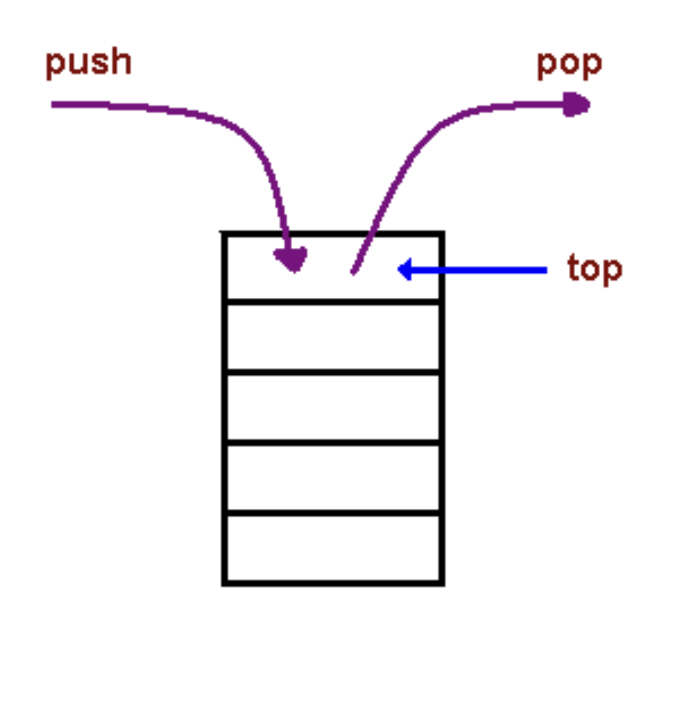

# Class 10

[Back to home page](../README.md)

## Understanding JS call stack

Q. What is a ‘call’?

- A call is when a function is invoked

Q. How many ‘calls’ can happen at once?

- One at a time, hense why the call stack is synchronous.

Q. What does LIFO mean?

- Last In First Out.

Q. Draw an example of a call stack and the functions that would need to be invoked to generate that call stack.

- 

Q. What causes a Stack Overflow?

- a stack overflow happens when a function calls itself with no endpoint, similar to an infinite loop.

## JavaScript error messages

Q. What is a ‘reference error’?

- A reference error accures when a value usually declared with let or const is not defined anywhere in the code.

Q. What is a ‘syntax error’?

- A syntax error accures when a line was typed incorrectly or couldnt be parsed according to the language you are using.

Q. What is a ‘range error’?

- A range error accures when an array/object is given an invalid length, such as a negative length.

Q. What is a ‘type error’?

- A type error accures when you are trying to access a value inside a incompatible property, such as accessing a null/undefined property.

Q. What is a breakpoint?

- A breakpoint is a set point in your text editor that will stop the executed code.

Q. What does the word ‘debugger’ do in your code?

- A debugger is a tool used to go line by line to find the error in your code.

## Bookmark

- [JavaScript errors reference on MDN](https://developer.mozilla.org/en-US/docs/Web/JavaScript/Reference/Errors)
