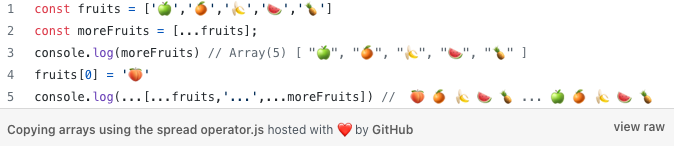
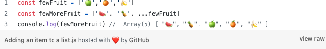
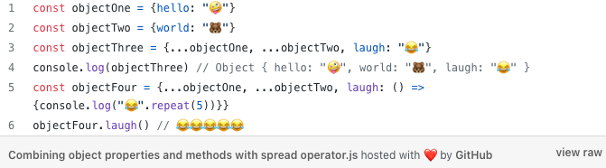

# Class 3

[Back to home page](../README.md)

## React Docs - lists and keys

Q. What does .map() return?

- .map() will return a new array of the elements from the array.

Q. If I want to loop through an array and display each value in JSX, how do I do that in React?

- You would need to use a for loop, .forEach, or .map to iterate through the array, then render the value through a component.

Q. Each list item needs a unique ____.

- Key.

Q. What is the purpose of a key?

- Keys are used for identification so react can see what has been added, taken, or changed in an array. You mostly see keys using .id or index as identifiers. Keys could look like this key={list.id/index}

## The Spread Operator

Q. What is the spread operator?

- A quick syntax using ...

Q. List 4 things that the spread operator can do.

- Adding items to arrays, combining arrays and objects, spreading an array into a functions argument, and even can make indepth copies of objects.

Q. Give an example of using the spread operator to combine two arrays.

- 

Q. Give an example of using the spread operator to add a new item to an array.

- 

Q. Give an example of using the spread operator to combine two objects into one.

- 

Examples found on [medium.com](https://medium.com/coding-at-dawn/how-to-use-the-spread-operator-in-javascript-b9e4a8b06fab)

## How to Pass Functions Between Components

Q. In the video, what is the first step that the developer does to pass functions between components?

- the developer uses increment = (name) => {} using the increment function on the value name, then using an arrow function followed by a code block.

Q. In your own words, what does the increment function do?

- Increment passes in an object value to change the value of state.

Q. How can you pass a method from a parent component into a child component?

- using increment, reference the function you want inside the child component.

Q. How does the child component invoke a method that was passed to it from a parent component?

- by calling the function inside the child component using this.whateverYouNamedTheFunction

Video link: [Passing functions between components](https://www.youtube.com/watch?v=c05OL7XbwXU)

## Bookmarks

- [React Tutorial through ‘Declaring a Winner’](https://reactjs.org/tutorial/tutorial.html)
- [React Docs - Lifting State Up](https://reactjs.org/docs/lifting-state-up.html)

## Things I want to know more about

what is the rest operator and how does it differ from spread?
