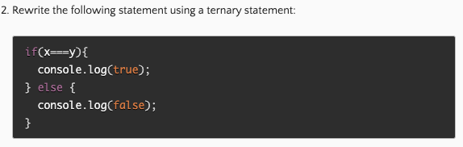

# Class 4

[Back to home page](../README.md)

## React docs - forms

Q. What is a ‘Controlled Component’?

- Controlled components are components where a forms data is handled through the use of state, updating with user input.

Q. Should we wait to store the users responses from the form into state when they submit the form OR should we update the state with their responses as soon as they enter them? Why.

- we should enter the responce as soon as the user types it in because the displayed value is this.state.value, meaning the react state is the source of truth.

Q. How do we target what the user is entering if we have an event handler on an input field?

- the value element is set on the form, so to target the user input, we need to target this.state.value.

## Ternarys

Q. Why would we use a ternary operator?

- A ternary is commonly used instead of a if else statement, or a true false. A good example is checking an object for a specific data value and return either yes or no.

Q. 

- x===y ? console.log(true); : console.log(false);

## Bookmark-

- [React-BS-forms](https://react-bootstrap.github.io/forms/overview/)
- [React-docs-conditional-rendering](https://canvas.instructure.com/courses/5862863/discussion_topics/16675528)

## Things I want to know more about

The use of controlled components still conduses me, I would like to see some more use of a controlled component and if there are other uses for them besides forms.
