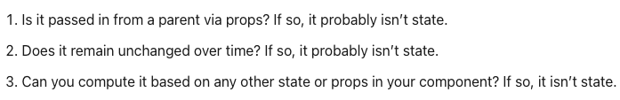

# Class 5

[Back to home page](../README.md)

## React docs - thinking in react

Q. What is the single responsibility principle and how does it apply to components?

- The single responcibility principle, or SRP for short is the the principle in coding that a module should have only one responcibility to not over complicate functionality.

Q. What does it mean to build a ‘static’ version of your application?

- Its pretty much a version of your application that looks like your actual app, but with no interactability for simplicity.

Q. Once you have a static application, what do you need to add?

- You will need to add the minimal set of mutable state.

Q. What are the three questions you can ask to determine if something is state?

- 
Found on [React.org](https://reactjs.org/docs/thinking-in-react.html), very good article.

Q. How can you identify where state needs to live?

- the best way to identify where state should go is by seeing what components will utilize state, and place it into the common owner, or a parent that state can be passed too.

## Higher - order functions

Q. What is a “higher-order function”?

- These are functions that run off of other functions either by returning them or passing them in as arguments.

Q. Explore the greaterThan function as defined in the reading. In your own words, what is line 2 of this function doing?

- From my understanding it looks like the function is declaring that m is greater than n, and returning it.

Q. Explain how either map or reduce operates, with regards to higher-order functions.

- .map is a good example of a higher order function, this takes in a previously defined array and iterates over it based on its parameters and returns a new array. Pretty much taking in a previously declared function and using it as a parameter.

## Things I want to know more about

What are some other examples of higher order functions and how simple would it be to rewrite functions to turn them into higher order functions?
