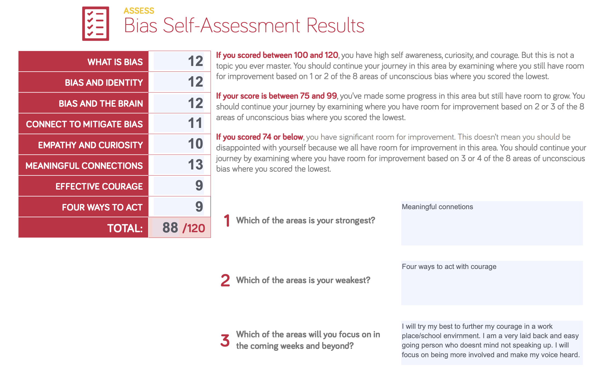

# Prework Growth Mindset

[Back to home page](../README.md)

## Resource links

- [Upgrade your technical skills](https://web.archive.org/web/20160616225417/http://www.happybearsoftware.com/upgrade-your-technical-skills-with-deliberate-practice)
- [Carol Dweck on the Growth Mindset](https://www.ted.com/talks/carol_dweck_the_power_of_believing_that_you_can_improve?language=en)
- [Angela Lee Duckworth on Grit](https://www.ted.com/talks/angela_lee_duckworth_grit_the_power_of_passion_and_perseverance)
- [Alain de Botton on Redefining Success](https://www.ted.com/talks/alain_de_botton_a_kinder_gentler_philosophy_of_success)

### Assessments

Emotional intelligents results -

- self-awarness, 19
- self-managment, 16
- social awarness, 21
- relationship managment, 17

This was good informtaion to assess and see a visable score on paper. I know now that self managment is something i should work on more. For example I tend to put off certain things until I really need to do them. Social awarness has always been a skill of mine though, as I tend to read people pretty well.
