# Prework SQL

[Back to home page](../README.md)

## SQL basics

Sql is a language that works with databases and their data. In this tutorial, there were 2 primary take aways. The first set of tutorials being how to query, or getting a specific set of data in your table. These commands can be as complex or simple as the user wants. The way we structure out a query is usually by starting with SELECTING the desired column FROM a specific table. If that is not enough, we can go even deeper with the WHERE, ORDER BY, and LIMIT commands. WHERE lets you apply any conditions to certain collums like showing specific values, greater than or less than, etc. You can order the list by either ascending or decending order, and lastly limit allows you to limit how much data you want back with either a max limit, or certain data between 2 specified ids (example: between items 4 and 8).

The second set of tutorials consisted of creating tables, updating or deleting collums or the table all together. Inserting rows and deleting rows is adding to the tables schema, while updating a row is updating the tables schema. The user can specify exactly what collums they want to updat/delete and UPDATE and DROP. This is useful if a table needs to change data in a specific part, or needs to be deleted all together. When creating a new table, the user will have to specify the colums with a name and data type, (such as Row 1, TEXT). This knowledge will come in handy as I progress further into 401.

### Pictures

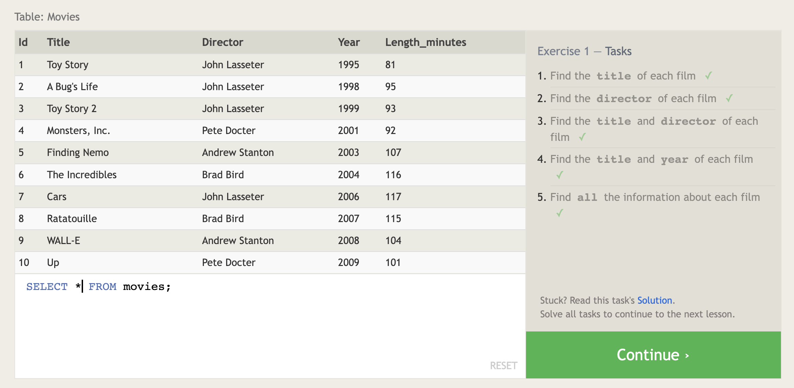

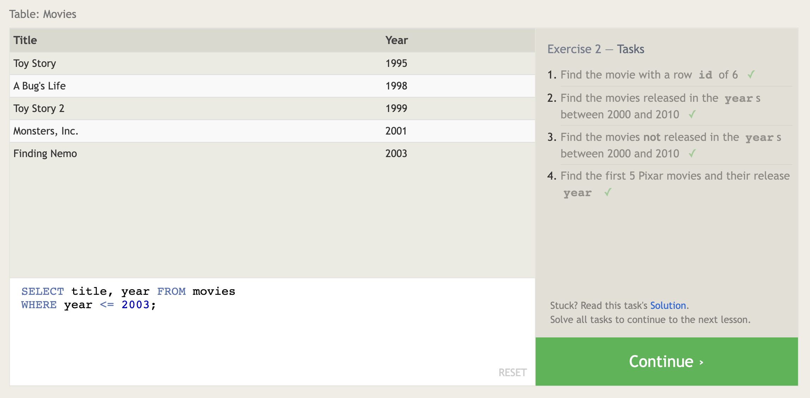

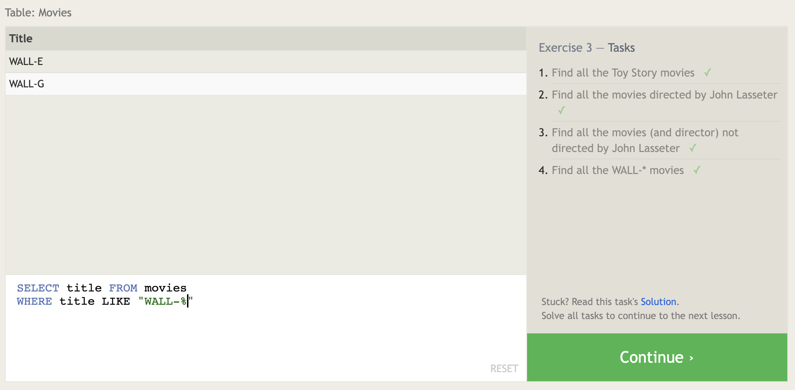

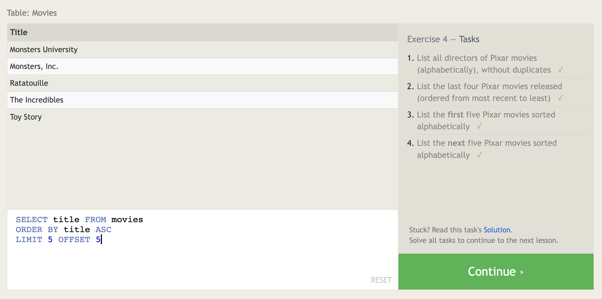

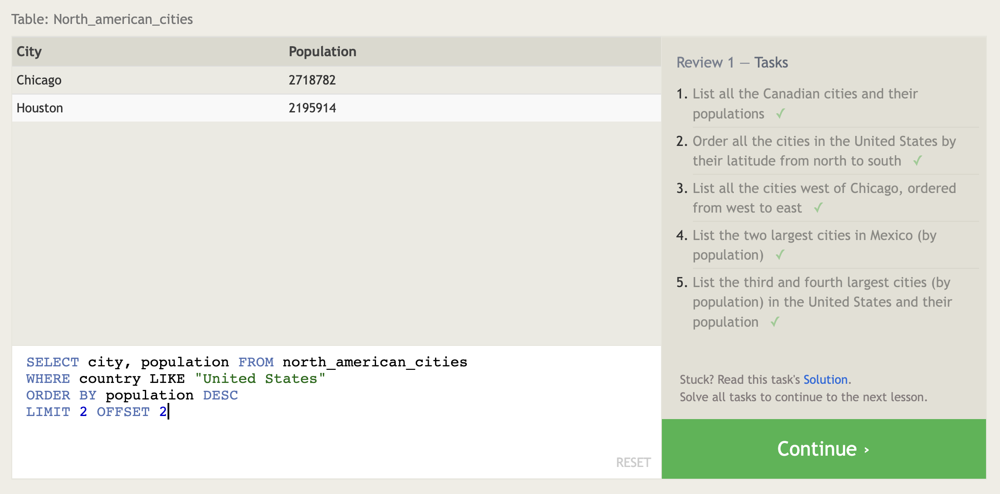

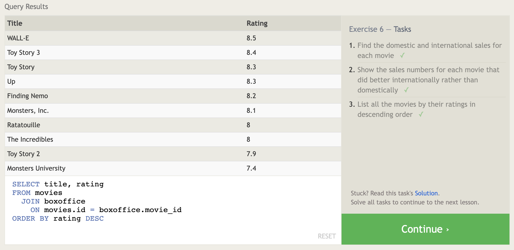

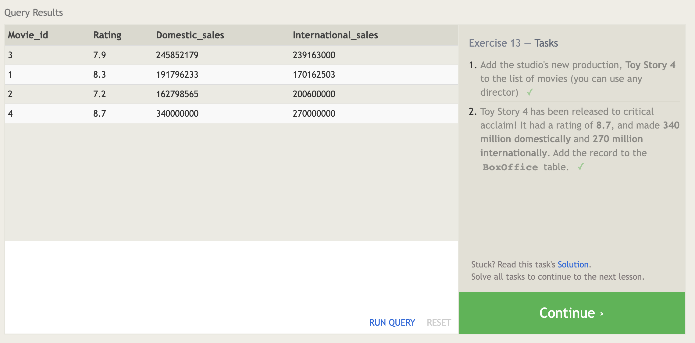

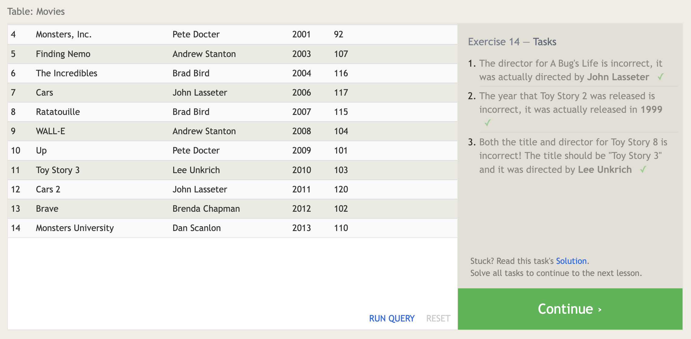

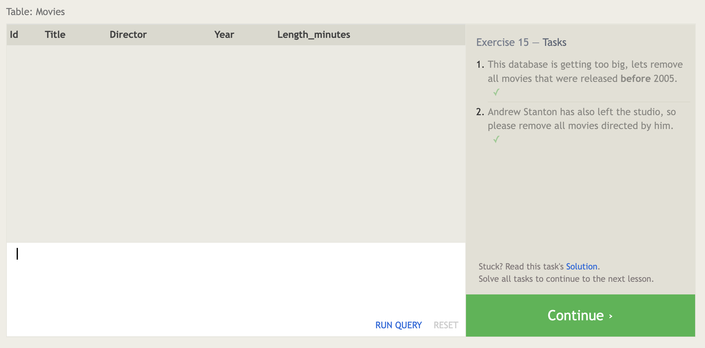

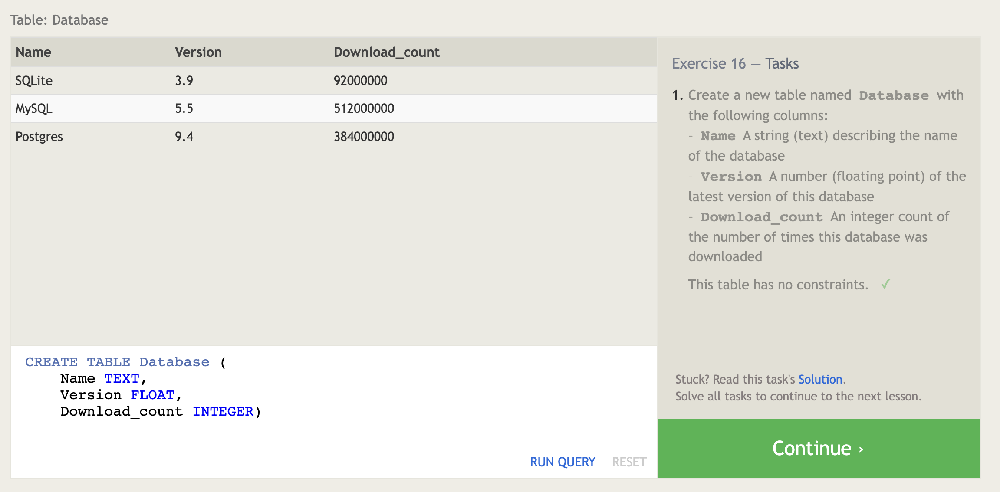

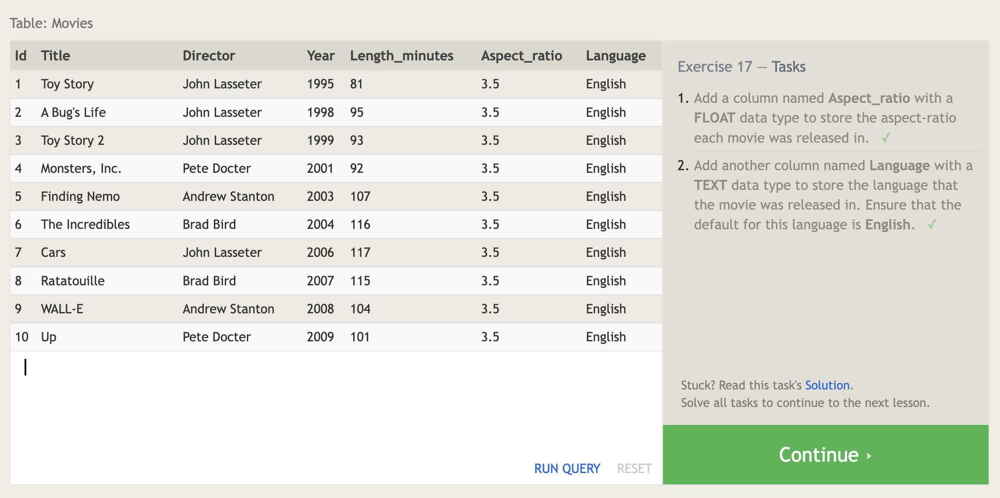

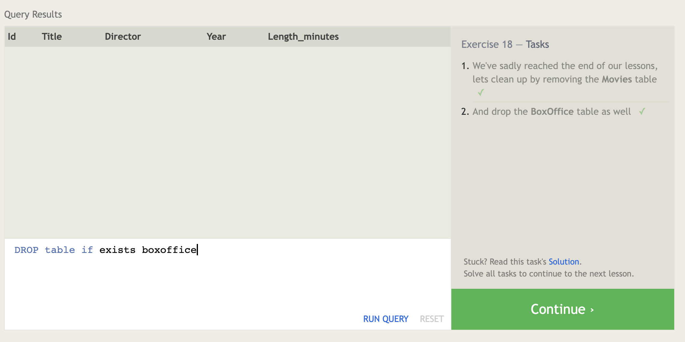