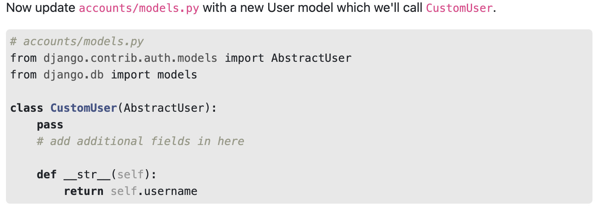
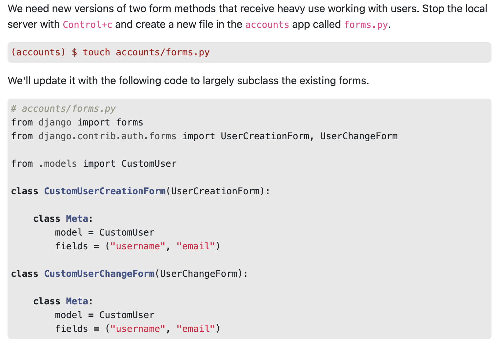
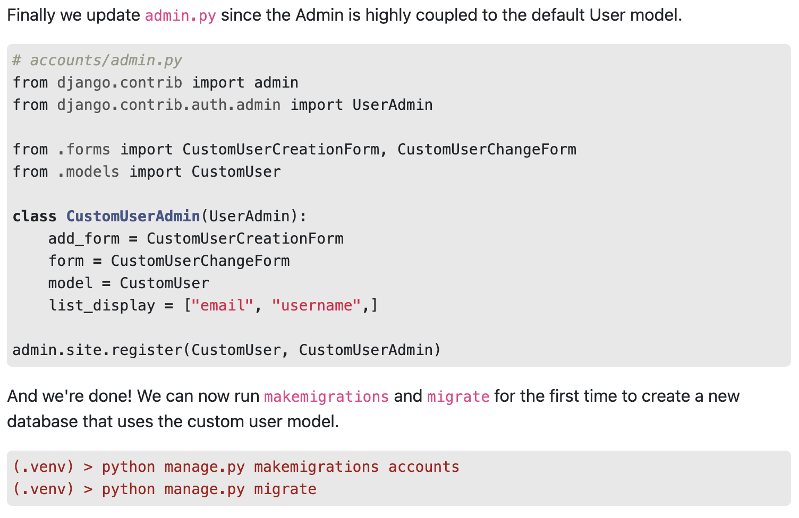

# Class 29

[Back to home page](../README.md)

## Django custom users

Q. What are the key benefits of using a Django Custom User Model, and how does it differ from the default Django User Model?

- The main benefits are flexibility of the interface, better security for the user, and ease of maintenance.

Q. Explain the process of creating and implementing a Custom User Model in Django, including the necessary changes to settings.py and the required model fields.

- First steps are of course setting up your VENV, django project, and an app called accounts. Update the settings INSTALLED_APPS section with accounts and at the bottom of the settings file, place the line AUTH_USER_MODEL = "accounts.CustomUser". Start creating your CustomUSer model inside the app. Here are some reference pictures to view -

Referenced from [Django Custum User Model](https://learndjango.com/tutorials/django-custom-user-model)

Q. What is DjangoX and how does it complement or extend the functionality of Django? Provide an example use case for incorporating DjangoX in a project.

- DjangoX is what you could call a batteries included Django starter project. This isa great framework to use because it comes out of the box with custom user model with email and password support. The main reason wyou would want to use a framework like this is to cut down on the setup for a new django project, as most of the default necessities are already built in. Its as easy as cloning and pip installing the requirments.

## Bookmark and review

- [Substituting a custom user model](https://docs.djangoproject.com/en/3.0/topics/auth/customizing/#auth-custom-user)

- [Creating a Custom User Model](https://www.youtube.com/watch?v=eCeRC7E8Z7Y&t=59s)
