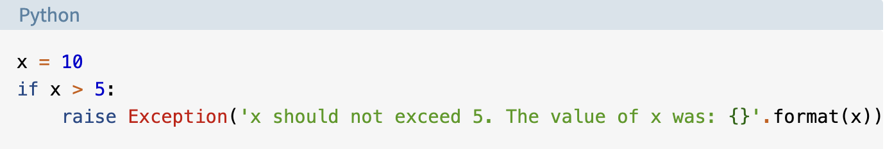
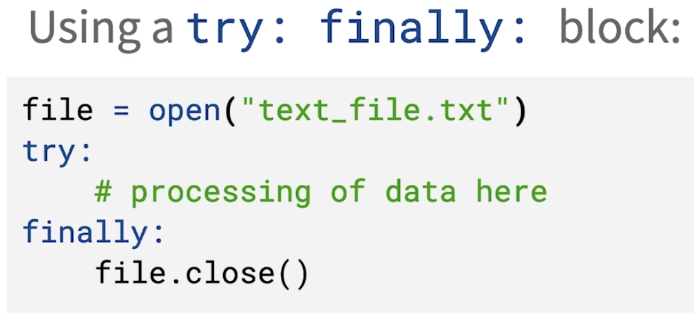
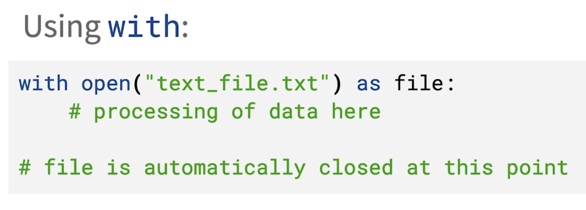

# Class 3

[Back to home page](../README.md)

## Read and write files in python

Files are vital to coding in python. Without them, you would just be writing on a piece of paper. A file is a set of bytes that are transfered into binary 1 and 0s for the computer to read. The structure of a file consists of a head, body and EOF (end of file).

- Header containes any meta data on the document.
- Body contains the actual code/data of the document.
- EOL containes a character to end off the document.

Another important thing to remember about files is their extension. For example a python file will end with a .py at the end of its name. Depending on a files extention, you can determine what type of file it will be.

As well as extensions, it is always best practice and important to close a python file. This is because not closing as file can cause unwanted bugs like cossupt data and running out of file handles. To open a file, use an open statement, and to close a file use the close statement.

## Exceptions in python

This article covered exceptions versus errors in python syntax. Syntax errors happen when code is typed improperly, such as an extra/missing character, or improper spacing. exception errors accur when the code is run and works fine but an error accurs in the logic arround python. This can be a variety of things from an equation not adding up, to improper naming of a certain variable.

A coder can also make their own exceptions depending on if they want to change the logic behind a variable. Heres an example...

In this example, the user raised an exception so a useres input cannot equal over 5.

## Read/write videos in python video

The video went over similar topics to the reading, but they mainly touched on opening, closing, and using the finally and with open methods to close files at the end of use.

The finally method functions very similarly to a try catch method.

Here are examples of the 2 methods.

## Bookmark and review

- [Reading and Writing Files in Python Quiz](https://realpython.com/quizzes/read-write-files-python/)

## Things I want to know more about

How often are exceptions in python used in the industry, and how deep can you go into making your own exceptions? Are there an universal exceptions we should put into our python modules?
