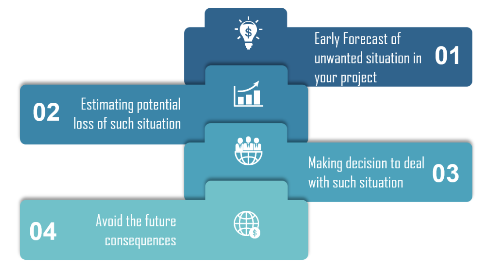

# Class 6

[Back to home page](../README.md)

## How to Use the Random Module in Python

Q. How can the random module be utilized in Python to generate random numbers or make selections from a list, and what are some common functions available within the module?

- The random module in python has 5 functions included. each with its own use...p.s. always make sure to **import random**

  1. randit(), this function will take 2 arguments, both integers, and return a random number within the range of the 2 arguments.
  2. random(), this function will choose a random number between 0 and 1. You can modify this to take bigger numbers by multiplying the function. (random.random() * 100)
  3. choice(), this function will take a collection element (list, tuple, set. etc) and return a random value from the specified collection element.
  4. shuffle(), this function will take in a list and shuffle the contents of the list in a random order.
  5. randrange(), this function will take in a start, stop and step argument, and return a randome element from the specified range.

## What is Risk Analysis

Q. In the context of software development, what is risk analysis, and what are the key steps involved in conducting a risk analysis for a software project?

- The context of risk analysis is the idea of calculating risk when developing an application, and going over all the specific areas of risk, such as hardware, storage, and making a plan to minigate as much of that risk as possible. These risks could also come back down on the company depending on the severity of these risks, so the company will have to calculate how much they are willing to take.

Here is a visual of calculated risk 

## Test Coverage

Q. What is test coverage and why is it an important (or potentially misleading) metric in software testing?

- Test coverage is incredibly important as it can cause much less stress later on for developers. The principle of test coverage is to have a good medium or tests that cover your code. This can prevent bugs popping up in the future and causeing more development time overall.

## Big O notation

Q. What is Big O notation, and how is it used to describe the performance of an algorithm? Give an example of an everyday task (not software related) that demonstrates O(n) time complexity.

- Big O is an algorythm that will calculate the time and space complexity of your function. Using the worst possible case(meaning the mongest possible amount of time for your function to go through its process) we can calculate how long it will take, as well as how much space is used can impact the timing of the function.

## Bookmark and review

- [Python Random](https://docs.python.org/3/library/random.html)
- [What is Dependency Injection](https://www.freecodecamp.org/news/a-quick-intro-to-dependency-injection-what-it-is-and-when-to-use-it-7578c84fa88f/)

## Things I want to know more about

In what context would you want to use the random function over the randint? Randit seems much better to use over a set number 0 and n(whatever number you chose), where as you can choose the numbers you want for your range.
