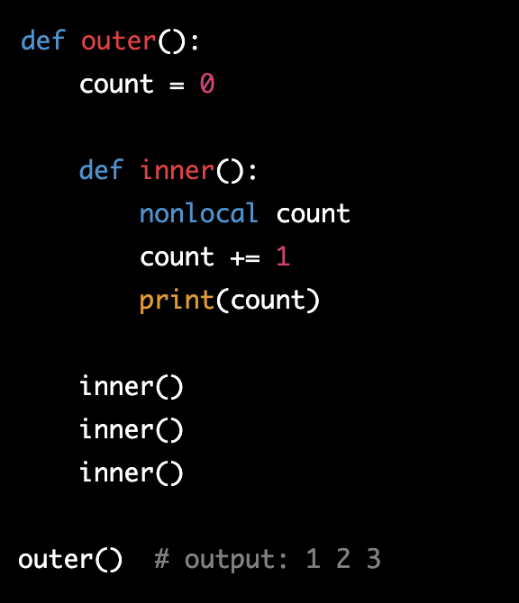

# Class 7

[Back to home page](../README.md)

## Python scope

Q. Explain the concept of variable scope in Python and describe the difference between local and global scope. Provide an example illustrating the usage of both.

- Variable scope is the concept of where a variable is located in a python file and who/what it can be accessed by. for example a global scope is a variable that can be accessed globally by any function. A global example could be a value thats primary use is to be used inside another function. Something like an increasing value like a score. Local scope refers to a variable that can only be accessed by a specific function/functions in a code block. For example if a variable like linked_list = Linkedlist() is declared inside a function, the value of linked_list can only be accessed by the function it is inside of. This is a common practice for values that dont need to appear again or in test blocks of code.

Q. How do the global and nonlocal keywords work in Python, and in what situations might you use them?

- The global and nonlocal key words are keywords you can declare infront of a variable name to signify if it is either using a global variable from inside a function, or using another variable from another function. For example the global keyword would be used like this...

In this example we are using the count variable that has been declared outside as a global, and using this particular variable in our function increment(). A nonlocal example looks like this...

In this example, we are using the count variable declared in a different function from an outer function. This is different from a global function because this function is nested within the outer() function.

## Big O notation

Q. In your own words, describe the purpose and importance of Big O notation in the context of algorithm analysis.

- Big O is a mathmatical notation used to describe both the time and space complexity of an algorithm. The primary purpose of big O is to analyse the speed an algorythm works based on input size. For example, how fast will a function be able to loop through a list depending on its size? If the list has thousands apon thousands of items/values, it will take much longer than if it were just a few items.

Q. Based on the Rolling Dice Example, explain how you would simulate a dice roll using Python. Describe how you would use code to calculate the probability of rolling a specific number (e.g., the probability of rolling a 6) over a large number of trials.

- To start off with simulating a dice roll. you would need to import random and print something like random.randit(1, 6). This element will print a random number between 1 and 6, just like a 6 sided dice. The way you could calculate the probability of a specific number rolling is by taking all your different opptions into account, and making a fu8nction in the with a range of said number and all the other options (take rolling 3 out of 6 as an example.) By iterating though the range of the 1-6, you can see your odds of rolling a 3 are 1/6 probability.

## Bookmark and review

- [Rolling Dice Examples](https://artofproblemsolving.com/wiki/index.php/Basic_Programming_With_Python#Program_Example_1_3)

## Things I want to know more about

What are some uses of nested functions? What is their purpose?
