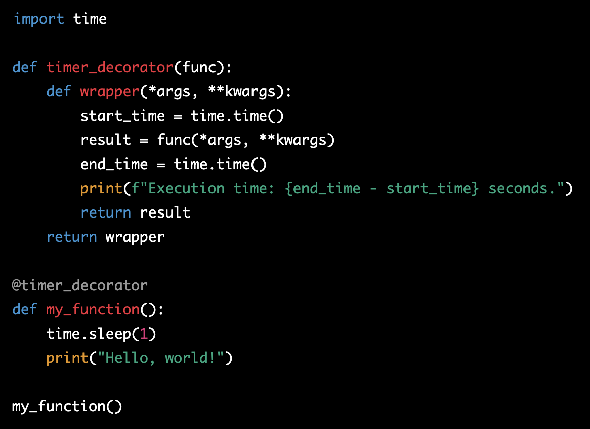

# Class 8

[Back to home page](../README.md)

## List comprehensions

Q. What is the basic syntax of Python list comprehension, and how does it differ from using a for loop to create a list? Provide an example of a list comprehension that squares the elements in a given list of integers.

- The basic syntax of a list comprehension is very similar to a for loop on the sense that we are iterating through the length of a list. A comprehension can be done in one line, here is an example of squaring numbers in a list...

numbers = [1, 2, 3, 4, 5] -iterable and variable

squares = [num**2 for num in numbers] -expression

print(squares) -output

- For a list comprehension, you will need an iterable(your list), the variable which represents your elements, and the expression itself.

Q. What is a decorator in Python?

- A decorator function is a function that modifies a function/methods behavior or extends it. It takes in the dseired function to be modified. This is so devs can modify functions without changing its source code.

Q. Explain the concept of decorators in Python. How do they work, and what are some common use cases for them? Provide an example of a simple decorator function from the reading.

- Decorators are represented with an @ symbol. Here is an example

In this example, we have a time function that will display Hello, world! after 1 second. The decorator function is taking in the time function, and adding a seperate function that will track the execution time of the function.

Some common uses for decorators are caching, logging actions, authorization based on user permissions. They can really be used for any function that needs a new piece added on but you dont want to change the source code.

## Bookmark and review

- [Primer on Decorators](https://realpython.com/primer-on-python-decorators/)
