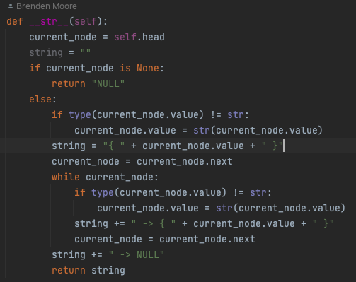
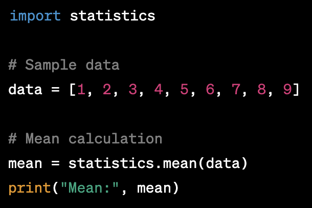

# Class 9

[Back to home page](../README.md)

## Dunder Methods

Q. What is the purpose of dunder methods in Python? Provide an example of a commonly used dunder method.

- Double-underscore methods in python are special methods that are used to define specific behavior to built-in python functions/operators. A common example is the __str__ method that is used too define how an object will view a string.

## AI guru

Q. In the video “AI Guru makes $238,800 with misleading paid course,” what was the main ethical issue raised concerning the use of developers’ work, and how might this have been avoided?

- By the looks of it, Siraj was taking peoples github code and not crediting those people properly. This can be a huge deal because it is stealing someones code they made from scratch and posting it as your own, or plagerism.

## Python statistics

Q. Describe the Python statistics module and give an example of a function within the module that can be used to perform a common statistical operation.

- statistics is a built-in library of python that features for a variety of statistical implications. Because it is a library you will need to import at the top of the page with (import statistics). For example, to calculate the mean of a list, you would simply write-

Adding all the numbers together in the list (45), then dividing by the length (9) will equal a mean of 5.

## Bookmark and review

- [Statistics Module](https://docs.python.org/3/library/statistics.html)

## Things I want to know more about

What is the difference between a function and a method? Where/when should I use one or the other?
